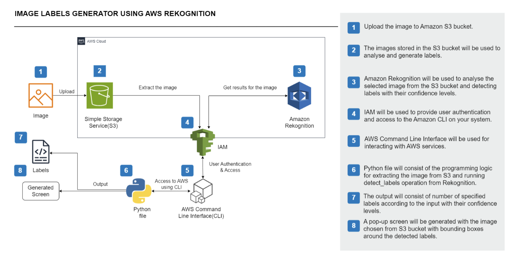
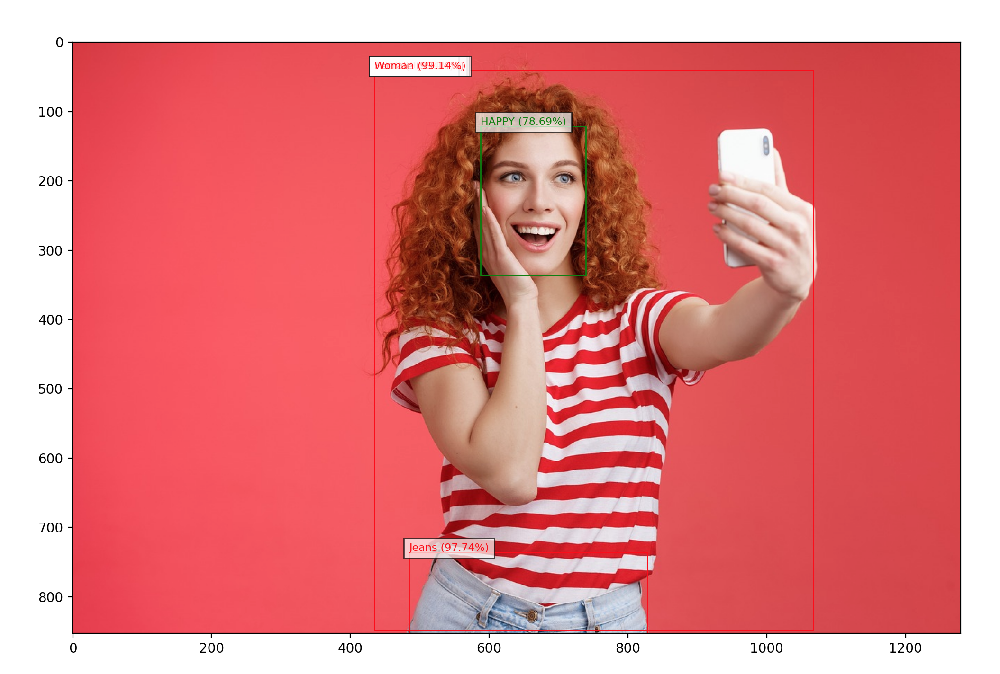
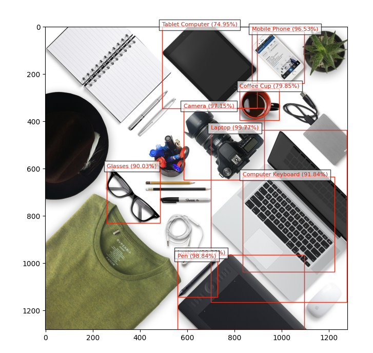

# Amazon Rekognition Label Generator

This Python script utilizes Amazon Rekognition, a deep learning-based image analysis service, to detect and label objects, scenes, and faces in images stored in an Amazon S3 bucket.

## Installation

1. Ensure you have Python installed on your system. You can download it from [here](https://www.python.org/downloads/).

2. Install the required Python packages using pip:

`pip install boto3`
`pip install matplotlib`

3. Set up your AWS credentials to allow access to Amazon Rekognition and your S3 bucket. You can do this by configuring the AWS CLI or by setting environment variables.

## Usage

1. Clone or download this repository to your local machine.

2. Place your images in an Amazon S3 bucket.

3. Modify the `main()` function in `start.py` to specify the photo name and S3 bucket name.

4. Run the script:

`python rekognition_label_generator.py`

5. The script will display the input image with bounding boxes and labels for detected objects, scenes, and faces.

## Architectural diagram

- _Architectural diagram created by Lucy Wang_.

## Results example

## Dependencies

- boto3: AWS SDK for Python. Used to interact with Amazon Rekognition.
- matplotlib: Python plotting library. Used for visualizing images and bounding boxes.
- PIL (Python Imaging Library). Used for image processing.
